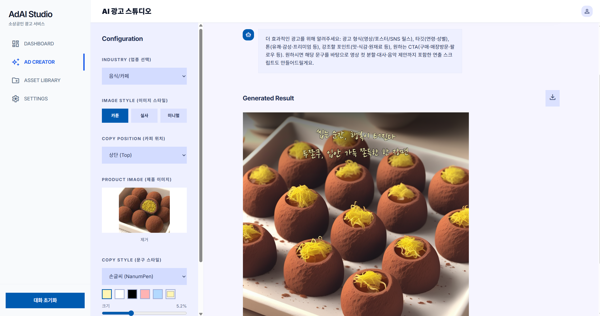

# AdGen.ai — AI 광고 & 플레이팅 비주얼 제작 서비스



생성형 AI를 활용하여 소상공인이 디자인 역량 없이도 **음식 플레이팅 사진**과 **광고 이미지/카피**를 자동 제작하는 서비스입니다.

---

## 주요 기능

### 플레이팅 모드
음식 사진을 업로드하면 ZoeDepth 깊이맵 → SDXL + ControlNet Depth로 무드 배경을 생성하고, rembg로 누끼를 딴 뒤 자동 합성합니다.

| 기능 | 설명 |
|------|------|
| 무드 컬러 8종 선택 | 화이트 / 베이지 / 테라코타 / 올리브 / 딥슬레이트 / 그레이 / 타우프 / 앤틱샌드 |
| 깊이맵 기반 배경 생성 | ZoeDepth(CPU) → ControlNet Depth + SDXL(ComfyUI) |
| 음식 누끼 자동 합성 | rembg(U2Net) + PIL 소프트 엣지 합성 |

### 광고 생성 모드
업종·테마·텍스트 설명만 입력하면 AI가 SDXL 배경을 생성하고 GPT가 한국어 카피를 작성합니다.

| 기능 | 설명 |
|------|------|
| 업종 / 카테고리 선택 | 음식 / IT / 패션 / 뷰티 / 기타 — 업종별 광고 전략 프롬프트 자동 적용 |
| 테마 / 스타일 선택 | 카툰 / 실사 / 미니멀 |
| 광고 이미지 생성 | ComfyUI → SDXL(DreamShaper XL) + IP-Adapter Plus (T4 GPU) |
| 제품 이미지 합성 | rembg 배경 제거 + IP-Adapter로 스타일 반영 |
| 광고 문구 생성 | GPT-4o-mini 기반 한국어 카피 자동 생성 (멀티턴 수정 가능) |

### 공통 편집 기능

| 기능 | 설명 |
|------|------|
| Fabric.js 캔버스 편집 | 텍스트 · 이미지 레이어 직접 편집 |
| 비율 4종 선택 | 1:1 (인스타 피드) / 9:16 (스토리) / 16:9 (와이드) / 21:9 (시네마틱) |
| 결과 저장 & 다운로드 | Supabase에 저장 후 PNG 다운로드 |

---

## 기술 스택

| 영역 | 기술 |
|------|------|
| 프론트엔드 | Next.js 14 (App Router) + Tailwind CSS + shadcn/ui |
| 캔버스 편집기 | Fabric.js 6 |
| 인증 / DB | Supabase (Auth + PostgreSQL + RLS) |
| 백엔드 API | FastAPI + Celery (비동기 작업 큐) |
| 메시지 브로커 | Redis |
| 이미지 생성 API | ComfyUI (workflow JSON 기반, port 8188) |
| 광고 생성 모델 | SDXL (Lykon/DreamShaper XL, fp16) + IP-Adapter Plus (h94/IP-Adapter ViT-H) |
| 플레이팅 배경 생성 | SDXL + ControlNet Depth SDXL 1.0 (ComfyUI) |
| 깊이맵 추출 | ZoeDepth (Intel/zoedepth-nyu, CPU) |
| 배경 제거 | rembg (U2Net, ONNX Runtime) |
| LLM | OpenAI GPT-4o-mini (프롬프트 빌드 + 카피 작성) |
| 컨테이너 | Docker (ComfyUI GPU pod + CPU backend/worker pod + Next.js frontend pod) |
| 오케스트레이션 | Kubernetes (GKE, T4 Spot GPU 노드) |

---

## 아키텍처

```
[사용자 브라우저]
      │
      ▼
[Next.js 프론트엔드]  nginx · LoadBalancer (port 3000)
      │  /api/backend/* → rewrites → backend-service:8000
      ▼
[FastAPI 백엔드]    비동기 작업 발행 → job_id 즉시 반환
      │
      ▼
[Redis]            브로커 + 결과 저장 (TTL 1h)
      │
      ▼
[Celery Worker]    CPU 노드
      │
      ├── [광고 생성 태스크]
      │   ├── build_sd_prompt()   → GPT-4o-mini: SDXL 영문 프롬프트 생성
      │   ├── write_copy()        → GPT-4o-mini: 멀티턴 한국어 카피 생성
      │   └── generate_image()   → ComfyUI: SDXL + IP-Adapter 이미지 생성
      │
      └── [플레이팅 태스크]
          ├── generate_depth_map() → ZoeDepth(CPU): 음식사진 → 깊이맵
          ├── generate_plating_image() → ComfyUI: ControlNet Depth + SDXL 배경 생성
          ├── rembg                → 음식 누끼 제거
          └── PIL 합성             → 배경 + 음식 합성

[ComfyUI Service]  GPU 노드 (T4 Spot) · ClusterIP · port 8188
      ├── 광고 생성: SDXL(DreamShaper XL) + IP-Adapter Plus → 1024×1024 PNG
      └── 플레이팅: SDXL + ControlNet Depth → 1024×1024 PNG

[프론트엔드]  GET /api/status/{job_id} 2초 폴링 → 완료 시 base64 이미지 수신
[Supabase]   campaigns / assets 테이블 저장 (RLS, 본인 데이터만 접근)
```

### VRAM 구성 (T4 14.56 GB · ComfyUI 관리)

ComfyUI `model_management.py`가 워크플로우 전환 시 IP-Adapter ↔ ControlNet Depth 자동 swap.

| 워크플로우 | 주요 컴포넌트 | VRAM |
|-----------|-------------|------|
| 광고 생성 | SDXL UNet + IP-Adapter + CLIP + VAE + 런타임 | ~8.2 GB |
| 플레이팅 | SDXL UNet + ControlNet Depth + CLIP + VAE + 런타임 | ~9.7 GB |
| T4 한계 | | 14.56 GB (여유 ~4.9 GB) |
| ZoeDepth | CPU RAM (Worker pod) | ~1.2 GB |

---

## 페이지 구성 (Next.js App Router)

| 경로 | 설명 |
|------|------|
| `/` | 대시보드 — 통계 (총 생성 수 / 활성 광고 / 저장 에셋), 최근 작업 목록 |
| `/editor?mode=plating` | 플레이팅 에디터 — 음식 사진 업로드 + 무드 선택 + Fabric.js 편집 |
| `/editor?mode=ad` | 광고 생성 에디터 — 업종/테마/텍스트 입력 + GPT 카피 + Fabric.js 편집 |
| `/assets` | 저장된 에셋 목록 |
| `/export` | 최종 결과물 확인 및 다운로드 |
| `/login` | Supabase 인증 로그인 |
| `/signup` | 회원가입 |

---

## 디렉토리 구조

```
project3_team/
├── backend/
│   ├── main.py              # FastAPI 엔드포인트 (/generate, /plating, /status/{job_id})
│   ├── tasks.py             # Celery 태스크 (generate_ad, plating_ad)
│   ├── comfyui_client.py    # ComfyUI HTTP 클라이언트 (SDXL+IP-Adapter / ControlNet Depth 워크플로우)
│   ├── pipeline_sdxl.py     # build_sd_prompt / write_copy / generate_depth_map (ZoeDepth)
│   ├── categories.py        # 업종별 광고 전략 프롬프트
│   ├── themes.py            # 테마별 스타일 프롬프트
│   ├── moods.py             # 플레이팅 무드 컬러 8종 → SDXL 프롬프트 매핑
│   ├── celery_app.py        # Celery 앱 설정
│   └── requirements.txt
├── frontend/
│   ├── app/
│   │   ├── page.tsx         # 대시보드
│   │   ├── editor/page.tsx  # 통합 에디터 (plating / ad 모드)
│   │   ├── assets/page.tsx  # 에셋 목록
│   │   ├── export/page.tsx  # 결과 다운로드
│   │   ├── login/page.tsx
│   │   ├── signup/page.tsx
│   │   └── api/
│   │       ├── generate/route.ts        # 광고 생성 프록시 (FormData → /generate)
│   │       ├── generate-copy/route.ts   # 카피 생성 프록시
│   │       ├── synthesize/route.ts      # 플레이팅 프록시 (FormData → /plating)
│   │       └── status/[job_id]/route.ts # 폴링용 상태 확인
│   ├── components/
│   │   ├── layout/          # Sidebar, Header
│   │   └── ui/              # shadcn/ui 컴포넌트 (Button, Card, Input 등)
│   ├── lib/
│   │   ├── supabase.ts      # Supabase 클라이언트 초기화
│   │   └── utils.ts         # cn 유틸
│   ├── public/styles/       # 테마 미리보기 이미지 (18종)
│   └── next.config.js       # /api/backend/* → backend-service:8000 rewrites
├── scripts/
│   ├── download_models.py   # ComfyUI 최초 기동 시 모델 자동 다운로드
│   └── entrypoint.sh        # ComfyUI 컨테이너 진입점
├── k8s/
│   ├── backend.yaml         # FastAPI Deployment + Service
│   ├── worker.yaml          # Celery Worker Deployment (CPU pod)
│   ├── frontend.yaml        # Next.js Deployment + LoadBalancer (port 3000)
│   ├── redis.yaml           # Redis Deployment + Service
│   ├── comfyui.yaml         # ComfyUI Deployment (GPU) + ClusterIP Service
│   ├── comfyui-models-pvc.yaml  # 모델 저장용 PVC (25Gi)
│   └── hf-cache-pvc.yaml    # HuggingFace 모델 캐시 PVC
├── supabase/
│   └── schema.sql           # campaigns / assets 테이블 + RLS 정책
├── workflow_basic.json      # ComfyUI 기본 워크플로우 (GUI 테스트용)
├── workflow_ipadapter.json  # ComfyUI IP-Adapter 워크플로우 (GUI 테스트용)
├── Dockerfile.backend       # python:3.11-slim (CPU, FastAPI + Worker 공용)
├── Dockerfile.comfyui       # pytorch:2.5.1-cuda12.4 + ComfyUI + IPAdapter_plus
├── Dockerfile.frontend      # Node 20 multi-stage → Next.js standalone (port 3000)
└── docs/
    ├── arch.md              # 시스템 아키텍처 다이어그램
    └── example.png
```

---

## GKE 배포

### 사전 요구사항

- GKE 클러스터 (T4 GPU 노드풀 포함)
- Artifact Registry 저장소
- Supabase 프로젝트 및 `NEXT_PUBLIC_SUPABASE_URL`, `NEXT_PUBLIC_SUPABASE_PUBLISHABLE_KEY` 발급

### DB 초기화 (Supabase)

Supabase 대시보드 > SQL Editor에서 `supabase/schema.sql` 전체 실행.

### Secret 생성

```bash
kubectl create secret generic ad-secrets \
  --from-literal=OPENAI_API_KEY=sk-... \
  --from-literal=NEXT_PUBLIC_SUPABASE_URL=https://xxx.supabase.co \
  --from-literal=NEXT_PUBLIC_SUPABASE_PUBLISHABLE_KEY=eyJ...
```

### 이미지 빌드 & 푸시

```bash
REGISTRY=asia-east1-docker.pkg.dev/<PROJECT>/ad-gen-project

docker build -f Dockerfile.comfyui -t $REGISTRY/comfyui:latest .
docker push $REGISTRY/comfyui:latest

docker build -f Dockerfile.backend -t $REGISTRY/backend:latest .
docker push $REGISTRY/backend:latest

# NEXT_PUBLIC_ 변수는 빌드 타임 번들링 필요
docker build -f Dockerfile.frontend \
  --build-arg NEXT_PUBLIC_SUPABASE_URL=<url> \
  --build-arg NEXT_PUBLIC_SUPABASE_PUBLISHABLE_KEY=<key> \
  -t $REGISTRY/frontend:latest .
docker push $REGISTRY/frontend:latest
```

### 배포

```bash
# PVC + ComfyUI (최초 기동 시 모델 자동 다운로드 ~15분 소요)
kubectl apply -f k8s/comfyui-models-pvc.yaml
kubectl apply -f k8s/hf-cache-pvc.yaml
kubectl apply -f k8s/comfyui.yaml

# 나머지
kubectl apply -f k8s/redis.yaml
kubectl apply -f k8s/backend.yaml
kubectl apply -f k8s/worker.yaml
kubectl apply -f k8s/frontend.yaml
```

### 배포된 pod 예시


### ComfyUI GUI 디버깅

```bash
kubectl port-forward deployment/comfyui 8188:8188
# → localhost:8188 에서 ComfyUI GUI 접근
# workflow_basic.json 또는 workflow_ipadapter.json 을 Load하여 테스트
```

---

## 모델 라이선스

| 모델 / 패키지 | 라이선스 |
|-------------|---------|
| Lykon/DreamShaper XL (SDXL) | Apache 2.0 계열 |
| h94/IP-Adapter Plus (SDXL ViT-H) | Apache 2.0 |
| diffusers/controlnet-depth-sdxl-1.0 | Apache 2.0 |
| Intel/zoedepth-nyu | MIT |
| ComfyUI | GPL-3.0 (서버사이드) |
| rembg (U2Net) | MIT |
| GPT-4o-mini (OpenAI API) | 상업 이용 허용 |
