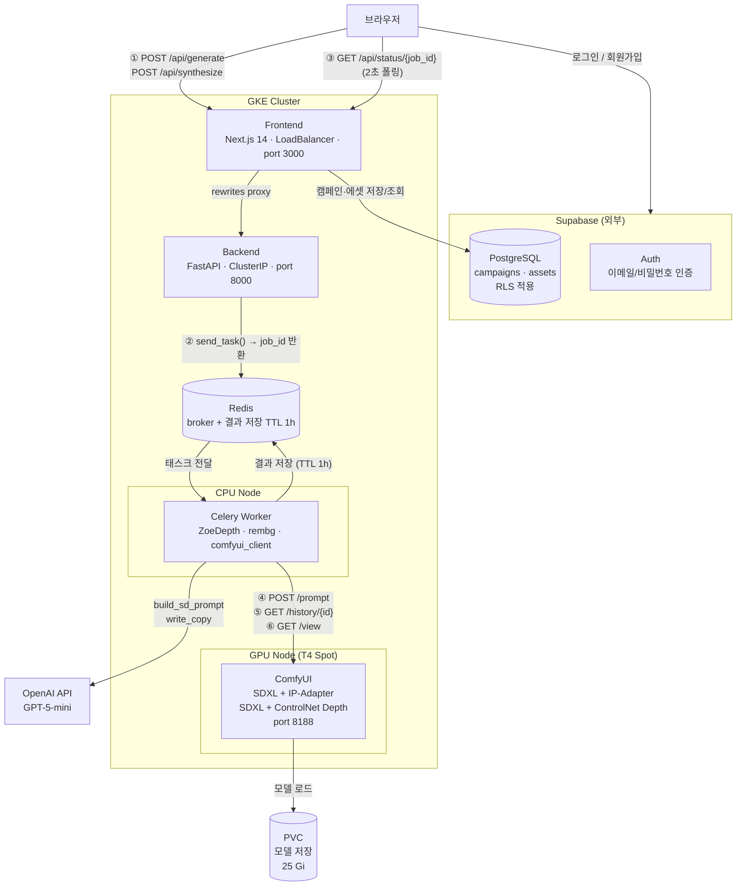
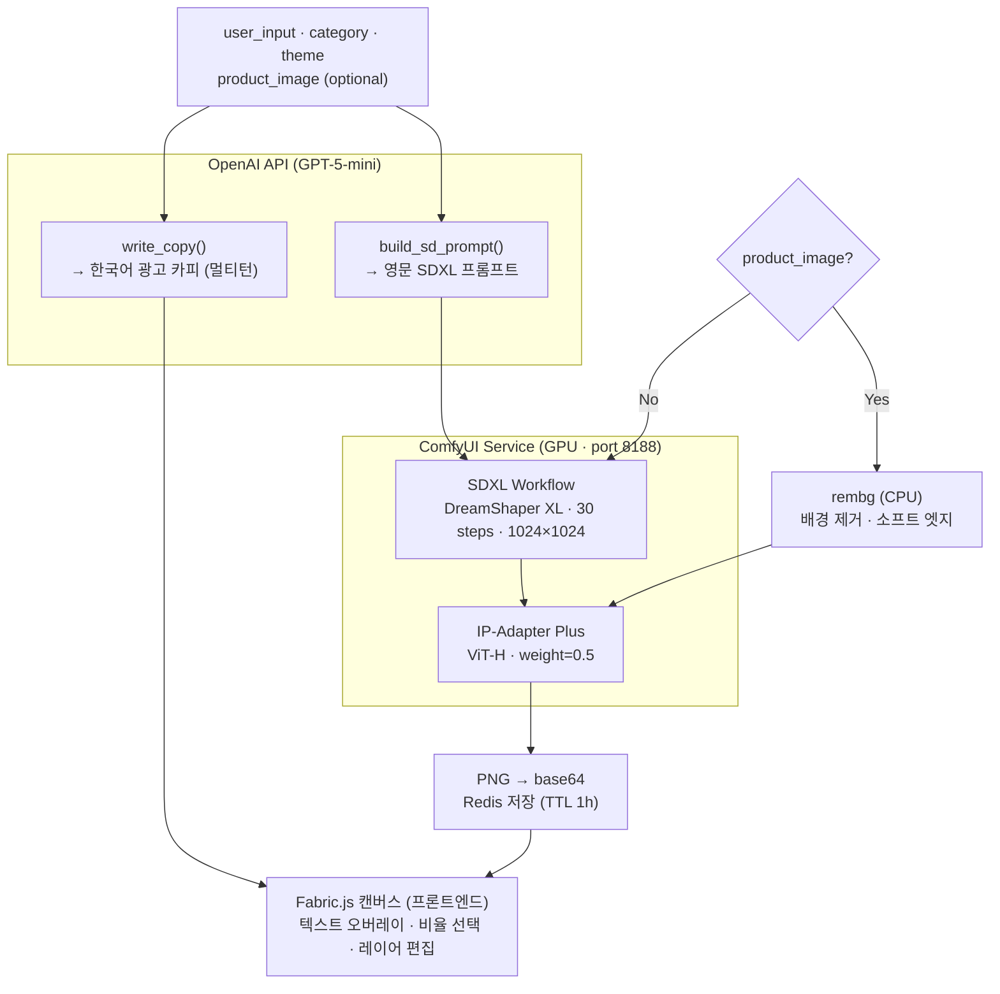
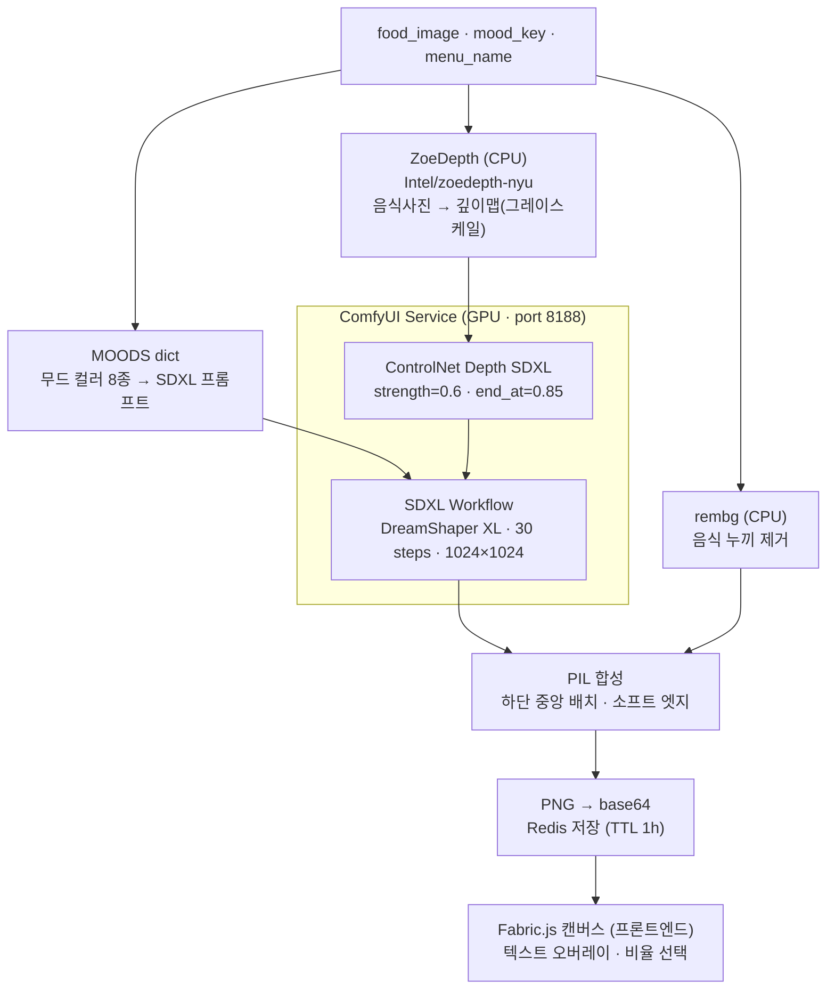
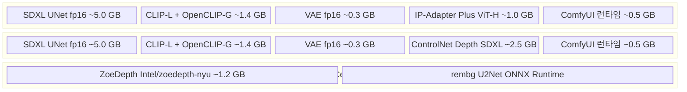
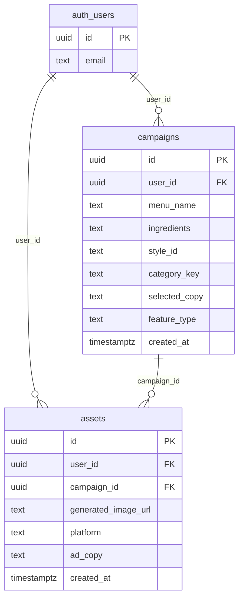

# Architecture

## 시스템 아키텍처



---

## 광고 생성 파이프라인



---

## 플레이팅 파이프라인



---

## VRAM 구성 (T4 14.56 GB · ComfyUI 관리)

ComfyUI `model_management.py`가 워크플로우 전환 시 IP-Adapter ↔ ControlNet Depth 자동 swap.



---

## ComfyUI 워크플로우 구조

### 광고 생성 — 기본 (제품 이미지 없음)

```
[1] CheckpointLoaderSimple (dreamshaper_xl.safetensors)
        ├── CLIP → [2] CLIPTextEncode (positive prompt)
        ├── CLIP → [3] CLIPTextEncode (negative prompt)
        ├── MODEL → [6] KSampler
        └── VAE   → [7] VAEDecode → [8] SaveImage
[4] EmptyLatentImage (1024×1024) → [6] KSampler
```

### 광고 생성 — IP-Adapter 포함 (제품 이미지 있음)

```
[1] CheckpointLoaderSimple
        └── [9] IPAdapterModelLoader + [10] CLIPVisionLoader + [11] LoadImage
                └── [12] IPAdapterAdvanced (weight=0.5)
                        └── MODEL → [6] KSampler → [7] VAEDecode → [8] SaveImage
```

### 플레이팅 — ControlNet Depth

```
[1] CheckpointLoaderSimple (dreamshaper_xl.safetensors)
        ├── CLIP → [2] CLIPTextEncode (무드 positive prompt)
        ├── CLIP → [3] CLIPTextEncode (negative prompt)
        ├── MODEL → [8] KSampler
        └── VAE   → [9] VAEDecode → [10] SaveImage
[4] EmptyLatentImage (1024×1024) → [8] KSampler
[5] ControlNetLoader (controlnet-depth-sdxl-1.0.safetensors)
[6] LoadImage (ZoeDepth 깊이맵)
        └── [7] ControlNetApplyAdvanced (strength=0.6, end_percent=0.85)
                └── positive/negative → [8] KSampler
```

KSampler 공통 파라미터: `steps=30`, `cfg=7.5`, `euler_ancestral`, `karras`, `denoise=1.0`

---

## Supabase DB 스키마



두 테이블 모두 RLS 적용 — `auth.uid() = user_id` 일치 시에만 본인 데이터 접근 가능.

---

## 접근 제어

| 서비스 | 노출 방식 | 비고 |
|--------|-----------|------|
| Frontend (Next.js) | LoadBalancer (공개) | port 3000 |
| Backend (FastAPI) | ClusterIP | `/api/backend/*` rewrites로 접근 |
| Worker | 없음 (Celery 소비) | Redis 큐 구독 |
| ComfyUI | ClusterIP (port 8188) | Worker에서만 접근, 외부 미노출 |
| Redis | ClusterIP | Backend ↔ Worker 브로커 |
| Supabase | 외부 SaaS | PUBLISHABLE_KEY + RLS로 보호 |

ComfyUI GUI 디버깅 시: `kubectl port-forward deployment/comfyui 8188:8188`
